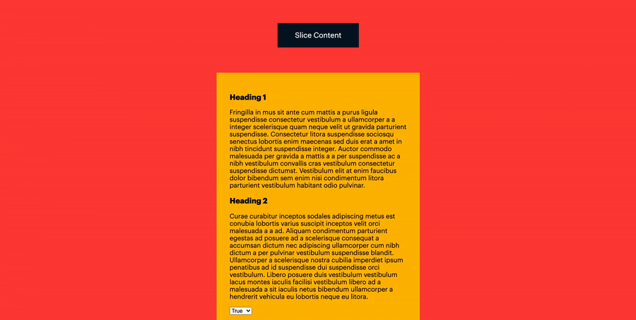

# Split Content takes your WYSIWYG content and splits it into chunks

Split Content will split text every time it reaches a new `<h3>` tag (or any tag you choose) and return the sections of content to use anywhere on the page.



## Demo

[Live demo on Codepen](https://codepen.io/joe_sandwich/pen/XWKjKzV)

## Use Cases

To avoid restrictions in a CMS e.g. Shopify, which only uses a single wysiwyg editor for product descriptions.

Often this doesn't give enough flexibility to present information to the user in a more structured way eg. in an accordion, tabs or in different containers. 

Split Content gives a client-friendly solution by allowing text to be separated by natural dividers in the text. With no dependencies it's highly unlikely to intefere with any of your existing code.


## Usage

`new ExtractText("your html selector", "parent element in DOM")`

Basic:

```js

Import ExtractText from 'extractText'

const extract = new ExtractText();

console.log(extract);

```

Advanced:

```js

Import ExtractText from 'extractText'

const extract = new ExtractText({
    selector: "h3", 
    parent: ".card",
    output: ""
});
console.log(extract);

```

## Browser support
Split Content is supported in recent versions of the following browsers:

- Google Chrome
- Firefox
- Edge
- Safari

Support can be extended through [Polyfill.io](https://polyfill.io/v3/)


## Roadmap

### v2

* ES9 Revised build
* Toggleable .format() function to stop Split Content working it's magic straight away
* Configurable array output to support JSON
* Inline script improvement - asynchronous loading
* Detatch function from window